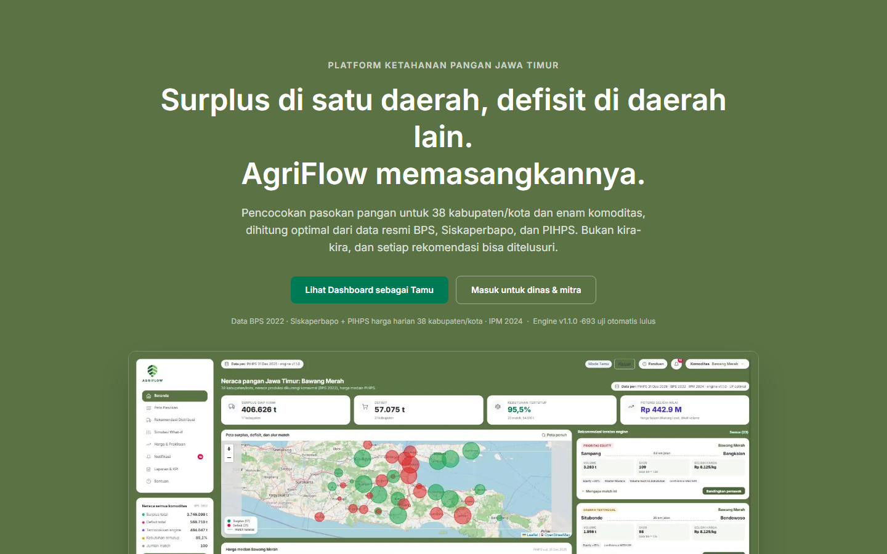
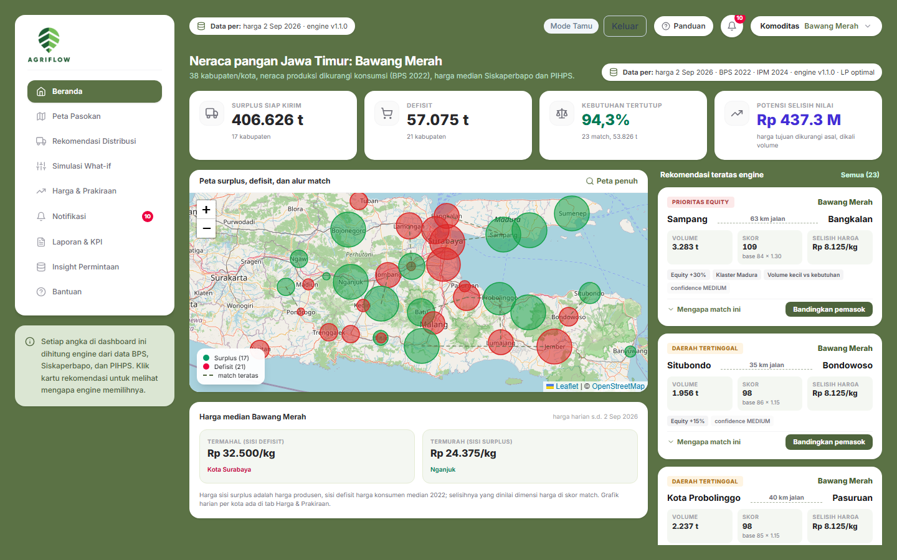
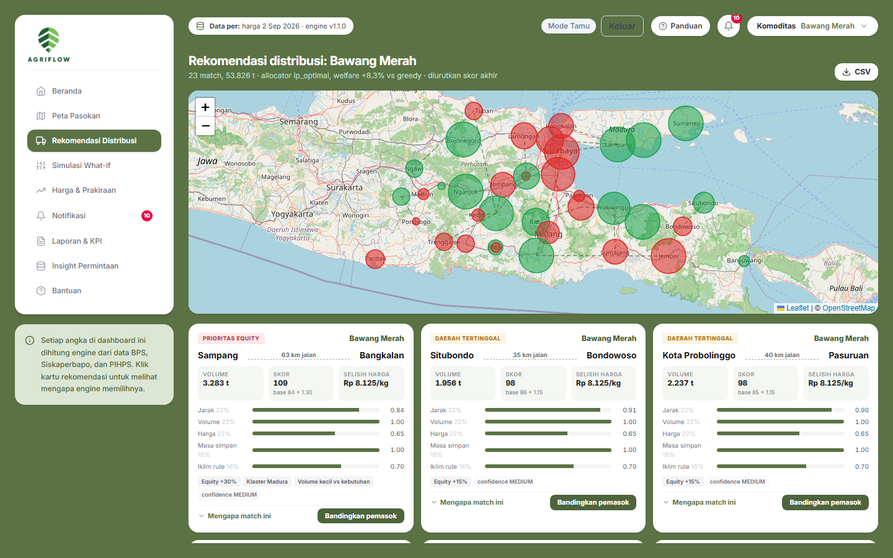
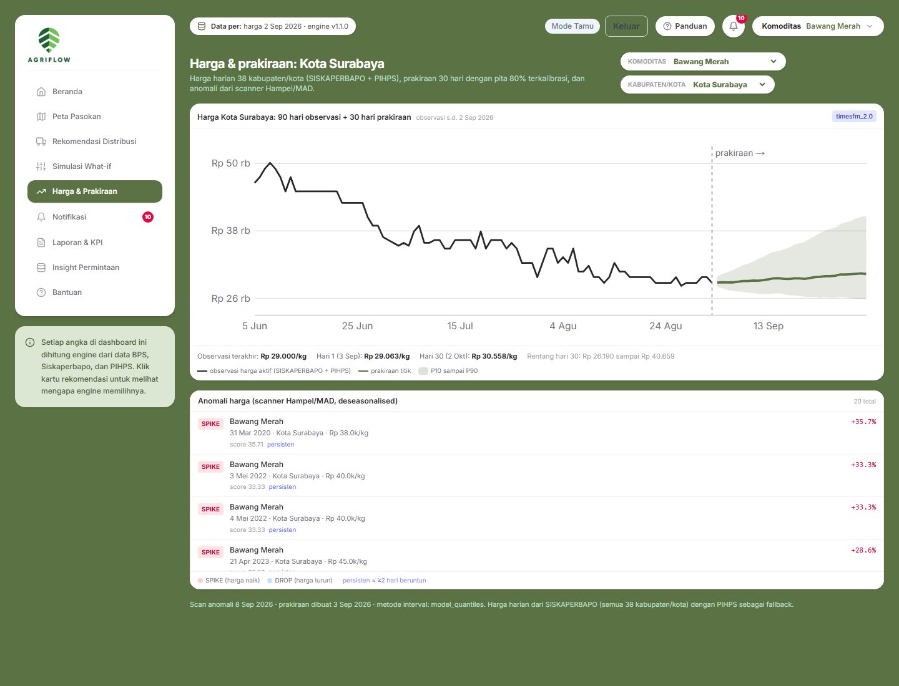
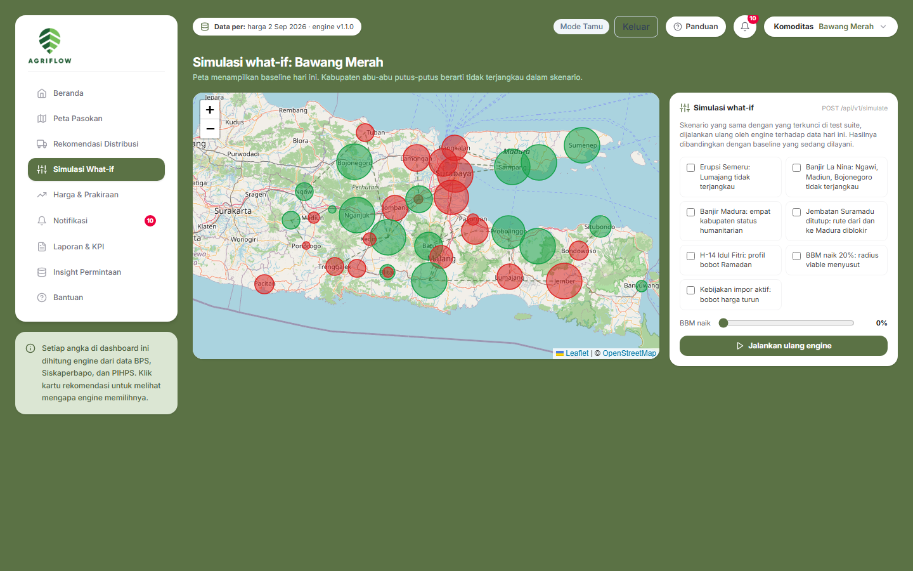
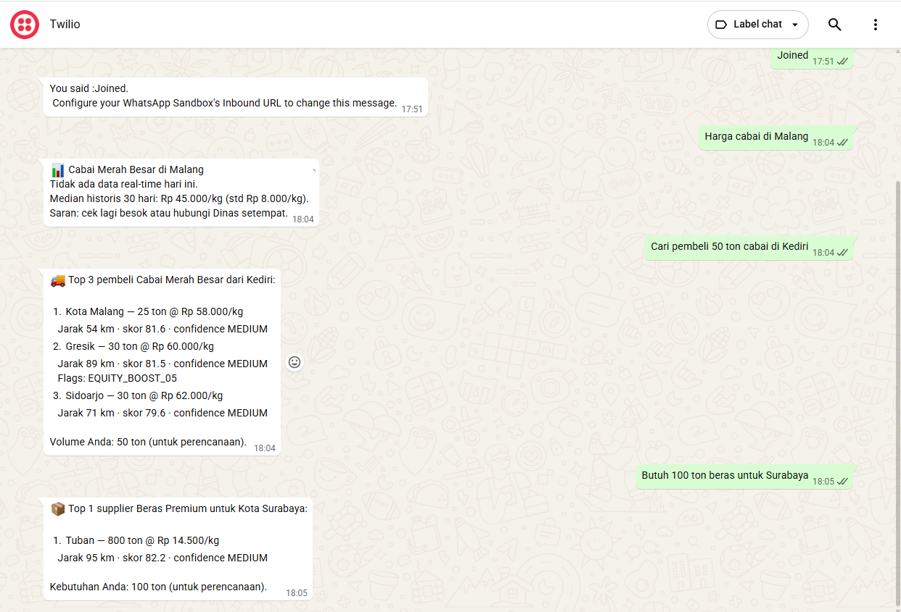
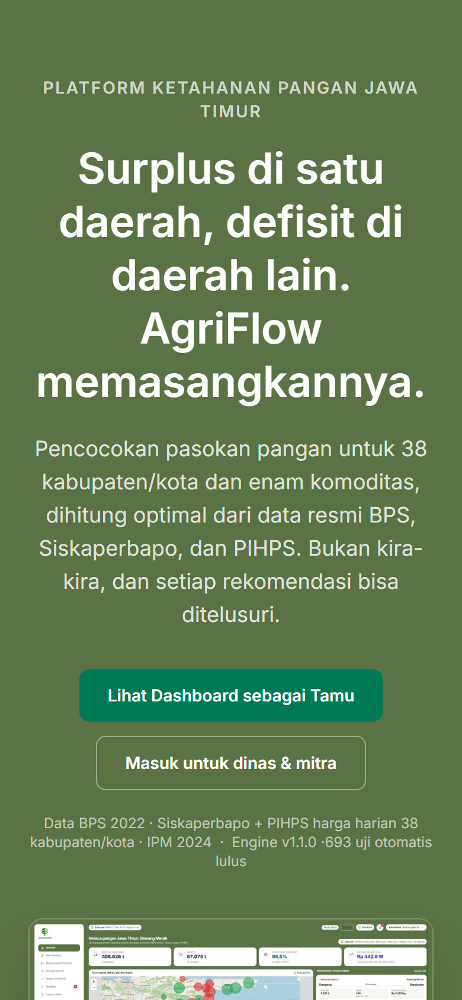

Language: [Bahasa Indonesia](./README.md) · **English**

<p align="center"></p>

<h1 align="center">AgriFlow</h1>

<p align="center"><strong>A food security platform for East Java that matches surplus regions with deficit regions.</strong></p>

<p align="center">
  <a href="https://www.agriflow.farm/"></a>
  
</p>

---

## 🌐 Website: [agriflow.farm](https://www.agriflow.farm/)

AgriFlow is available at **[www.agriflow.farm](https://www.agriflow.farm/)**. Open it, click **"Lihat Dashboard sebagai Tamu"** (view the dashboard as a guest), and you can explore the map, distribution recommendations, price forecasts, and what-if simulations without creating an account. Government agencies and partners sign in through **"Masuk untuk dinas & mitra"**. The site itself is in Bahasa Indonesia.

<p align="center"></p>

> This repository holds only the description and screenshots. The AgriFlow source code lives in a private repository, where development continues.

---

## The problem

In one regency the harvest is plentiful and prices collapse, while next door supply is thin and prices climb. There is often enough food overall; it is going to the wrong places. Matching the two sides has been manual and slow, so local governments tend to learn about a shortage only after prices have already moved.

## What AgriFlow does

AgriFlow computes a food balance for every regency and city (production minus consumption), then pairs surplus regions with deficit regions. It covers **38 regencies and cities in East Java** and **six commodities**: premium rice, medium rice, red chili, bird's eye chili, shallots, and garlic.

It has three functions:

| Function | What it does |
|---|---|
| **Detect** | Flags abnormal price spikes and drops in daily prices, after removing seasonal patterns |
| **Predict** | Forecasts prices 30 days ahead for each regency or city, with an uncertainty range |
| **Distribute** | Recommends shipments from surplus to deficit regions, weighted to give priority to less developed regions |

---

## How it works

```
    OFFICIAL DATA                        AGRIFLOW ENGINE                      ACCESS
  ┌───────────────────┐     ┌──────────────────────────────────┐
  │ BPS 2022          │     │ 1. Food balance per region        │
  │ production, use   │────▶│ 2. Price anomaly detection        │──┬──▶ Web dashboard
  │ Siskaperbapo+PIHPS│     │ 3. 30-day price forecast          │  │    (agriflow.farm)
  │ daily prices      │     │ 4. Surplus-to-deficit matching    │  │
  │ HDI 2024          │     │    (4 layers, LP-optimal)         │  └──▶ WhatsApp bot
  │ road distance     │     └──────────────────────────────────┘       (Indonesian & Javanese)
  └───────────────────┘
```

**1. Official data only.** Production and consumption come from BPS (Statistics Indonesia) 2022. Daily prices for all 38 regions come from Siskaperbapo East Java, with PIHPS as the fallback. The 2024 Human Development Index (IPM) sets the fairness weights. Distances follow real roads, not straight lines. When a source has no figure, the dashboard shows a blank instead of a guess.

**2. Food balance.** For each commodity and region, the engine works out whether the region is in surplus or deficit, and by how many tonnes.

**3. Anomaly detection.** Daily prices are stripped of their seasonal pattern (for example the run-up to Eid), then checked with a Hampel/MAD filter that holds up against outliers. The result feeds two places: alerts on the dashboard, and a gate that stops suspicious price data from skewing the distribution recommendations.

**4. Price forecasting.** Prices 30 days ahead are forecast with the TimesFM 2.0 time-series model, shown with a P10 to P90 band. A simpler seasonal model, backtested on historical data at 10.8% MAPE, serves as the fallback.

**5. Four-layer matching.** Every surplus-deficit pair passes four stages:

| Layer | Question it answers |
|---|---|
| Hard constraints | Can the route be covered before the produce spoils? Is the distance reasonable? |
| Scoring | How good is this pair on distance, volume, price gap, shelf life, and route weather? |
| Equity | Is the destination a less developed (low-HDI) region that should come first? |
| Allocation | How many tonnes go where, solved as a linear program so the result is optimal across the whole province rather than just the nearest pairs |

**6. Explainable.** Every recommendation has a **"Mengapa match ini"** (why this match) card showing origin, destination, distance, the score on each dimension, and the reason it was chosen.

---

## Screenshots

**Dashboard home.** Surplus, deficit, demand covered, and value at stake, plus a map of surplus (green) and deficit (red) regions and the top recommendations.

<p align="center"></p>

**Distribution recommendations.** Every pair the engine suggests, with its score broken down by dimension. The list can be exported as CSV.

<p align="center"></p>

**Prices and forecast.** The last 90 days of prices, a 30-day forecast with its uncertainty band, and the price anomalies for the selected region.

<p align="center"></p>

**What-if simulation.** Re-run the engine under scenarios such as a Semeru eruption, flooding, closure of the Suramadu Bridge, the two weeks before Eid, or a fuel price rise, and compare the outcome with today.

<p align="center"></p>

**WhatsApp bot.** Farmers can ask for prices, look for buyers or suppliers, and see forecasts over chat, in Indonesian or Javanese.

| Bahasa Indonesia | Javanese |
|:---:|:---:|
|  |  |

**On a phone.** The landing page adapts to small screens.

<p align="center"></p>

---

## Where it stands

- Running in production at [agriflow.farm](https://www.agriflow.farm/), with guest access for reviewers.
- Engine version 1.1.0, with 702 automated tests passing.
- Tried by five early testers (farmers and one researcher), with the need validated through interviews with four farmers across different commodities.

## Known limits

- Coverage is East Java only. Expanding depends on regency-level public data being available elsewhere.
- Production and consumption figures are from 2022, the most complete year across all sources.
- The TimesFM 2.0 forecast has not yet been backtested on this data; the measured accuracy figure belongs to the fallback model.
- AgriFlow connects sellers and buyers but does not yet handle the transaction.

---

## Team

| Name | Role | LinkedIn |
|---|---|---|
| Chelsea | Data Analyst | [chelseaayu](https://linkedin.com/in/chelseaayu) |
| Hilmi | Data Architect | [hilmi888](https://linkedin.com/in/hilmi888/) |
| Monika | UX Researcher | [monika-hermiani](https://linkedin.com/in/monika-hermiani) |
| Irpan | Data Engineer | [irpanpilihanrambe](https://linkedin.com/in/irpanpilihanrambe) |

Built for Bank Indonesia's PIDI DIGDAYA x Hackathon 2026.

## Contact

Hilmi · [master-hilmi.vercel.app](https://master-hilmi.vercel.app/)

To work with us or pilot AgriFlow in your region, reach out through the link above.

<p align="center"><em>Detect · Predict · Distribute, for food security in Indonesia.</em></p>
